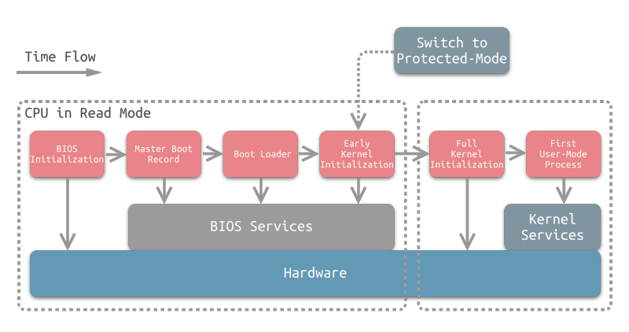
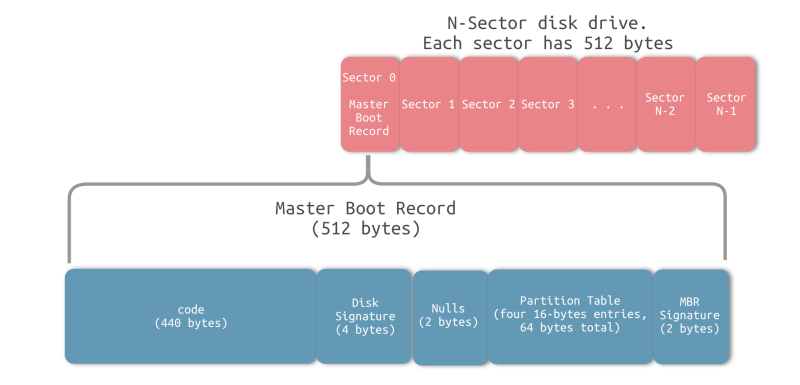

# 从 Bootloader 到 kernel

## 一、  主要流程
----

1. 主板芯片组固件程序，尝试启动 cpu

2. cpu重置， 其中 CS:IP 指向 BIOS 的程序 
   * 8086 会设置为 0FFFFH:0

3. BIOS 初始化，包括
   * 安装中断向量
   * 机器硬件自检，cpu，显卡，内存，鼠标，键盘等能否使用
   * 记录硬件信息到内存，以便被操作系统内核使用
   * 搜索MBR（master boot record， 主引导记录）， MBR包含: BootLoader、PartitionTable、EndMark
   * 把 BootLoader 的内容加载到内存， 常见的BootLoader有grub, lilo, spfdisk

4. BootLoader 执行
   * 初始化内存盘，也就是内存中的initrd文件系统 (为内核准备环境)
   * 加载内核镜像vmlinuz，并解压，解压完成后，内核就加载完成
   * grub控制权交给内核

5. 内核启动
   * 内核把控制权交给initrd中的init脚本，该脚本加载各种设备驱动
   * 创建根设备，并挂载rootfs
   * 执行真正根文件系统的/sbin/init进程，内核进程正式启动

6. 系统初始化
   
   /sbin/init 进程执行/etc/inittab来完成系统的初始化
   1. 设置运行等级
        * 0：系统停机模式, 系统默认运行级别不能设为0，否则不能正常启动
        * 1：单用户模式, root权限，用于系统维护，禁止远程登陆
        * 2：无网络支持的多用户模式, (没有NFS)
        * 3：有网络支持的多用户模式, (有NFS)，登陆后进入控制台命令行模式
        * 4：保留，未使用
        * 5：有网络支持、有 X-Window 支持的多用户模式, 登陆后进入图形GUI模式
        * 6：重新引导系统，即重启
    1. 执行rc.sysinit
        * 设置PATH
        * 配置网络/etc/sysconfig/network
        * 启动 swap 分区
        * 设置 /poroc
    2. 根据第一步设置的运行级别，运行rc0.d ~ rc6.d 中的脚本，启动对应的服务
    3. 执行/etc/rc.d/rc.local
        * 这个是linux用户进行个性化启动、设置的脚本
    4. 执行 /bin/login
        * 进入等待登录状态

系统启动过程图

MBR结构图

## 参考
----
1. [计算机那些事(2)——开机启动过程](https://www.jianshu.com/p/f8040cc6e0de)
2. [Kernel Boot Process](https://github.com/0xAX/linux-insides/blob/master/Booting)
3. [Linux系统——运行级别](https://www.cnblogs.com/lj-cn/p/7080561.html)